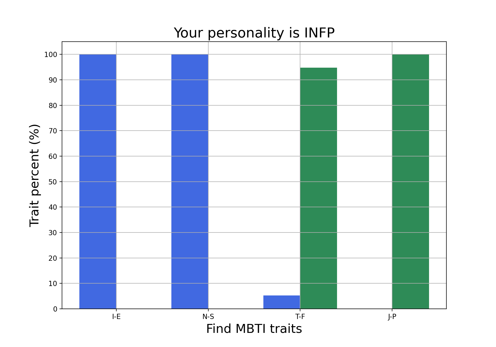
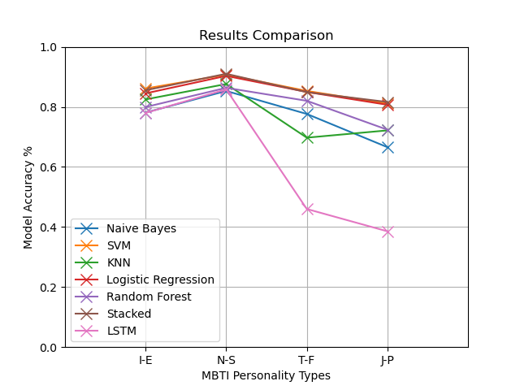

# Predicting Personality Traits with MBTI

 

<a href="https://prezi.com/view/Kt0lG7kZ3Tk7KsEYMPlg/"><strong>Explore the presentation »</strong></a>

 

+ Use one or more datasets with at least 2000 records, each record containing a piece of natural language text written by an individual, and the values for a set of personality indicators (corresponding to the Big Five/MBTI, etc.) associated with that individual. Perform preprocessing of the datasets, feature selection and/or extraction, vectorization for text-type features, and division into training/testing sets.

+ Train a series of models (SVM, Random Forest, Logistic Regression, Naive Bayes, KNN). Optimize the hyperparameters for each model (e.g., Random Search, Grid Search). Try combining multiple models to obtain a better model (e.g., stacking).

+ Create a graphical interface that allows the selection of the used model and the input of a new text both manually and by attaching a file. Display the predicted values for the personality indicators using the selected model through the interface.

+ Bonus: Also utilize the LSTM model.

  

### Wordclouds:

 

  

### Personality example:

 

  

### Results:

 

  
